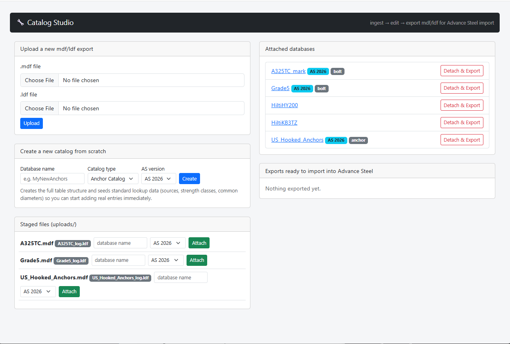
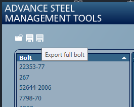
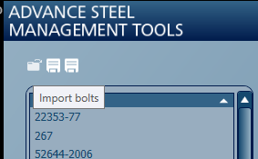
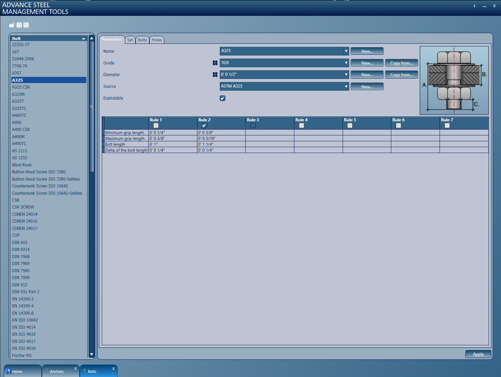
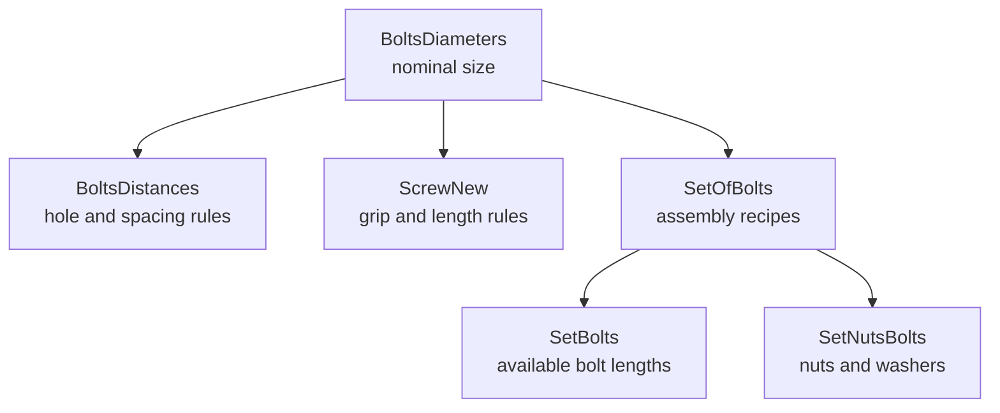

# Advance Steel Catalog Studio

> Because handling your Advance Steel bolt and anchor data should be easy.

[](https://www.python.org/)
[](https://flask.palletsprojects.com/)
[](https://www.autodesk.com/products/advance-steel/overview)
[](LICENSE)

**Advance Steel Catalog Studio** is a local, browser-based workbench for inspecting, editing, repairing, creating, and exporting Autodesk Advance Steel component catalogs stored as SQL Server `.mdf` / `.ldf` database pairs.

It replaces fragile, repetitive table-by-table editing with a guided workflow that understands the relationships behind bolt diameters, bolt lengths, nuts, washers, assembly sets, grip rules, and edge distances.



## Why this exists

Adding a bolt diameter to an Advance Steel catalog is not a single-row operation. A usable diameter may depend on coordinated records across six tables. Miss one relationship—or store an imperial size incorrectly—and the diameter can appear in Advance Steel while its bolts disappear, fail length calculation, or break connection joints.

Catalog Studio gives those databases a safer workshop:

- Work against a disposable Docker SQL Server instead of the live Advance Steel installation.
- Upload and attach existing `.mdf` / `.ldf` catalog pairs.
- Create new bolt or anchor catalog structures from scratch.
- Browse, filter, add, duplicate, edit, and delete database records.
- Clone a working bolt diameter across its related tables.
- Preview changes before applying them.
- Detect orphaned diameter records.
- Find and replace text across database tables.
- Detach and export the finished database pair for Advance Steel import.

## Project status

Catalog Studio is an active, early-stage workshop tool built from real Advance Steel catalog investigation.

| Area | Current status |
| --- | --- |
| Validated Advance Steel version | **2026** |
| Catalog types | Bolt and anchor |
| Guided bolt-diameter cloning | Implemented |
| Existing catalog ingest/export | Implemented |
| New catalog scaffolding | Implemented |
| Raw table editing and filtering | Implemented |
| Multi-user or internet deployment | Not supported |

> [!CAUTION]
> Use copies of catalog databases and keep an untouched backup. This tool can make destructive database changes by design. It is intended for local use on a trusted machine or LAN—not exposure to the public internet.

## Quick start

### Prerequisites

- Linux, or Windows with WSL2
- Docker
- Python 3.12 or newer
- An exported Advance Steel catalog `.mdf` / `.ldf` pair if you want to modify an existing catalog

### 1. Clone and install

```bash
git clone https://github.com/meistro57/Advance_Catalog_Studio.git
cd Advance_Catalog_Studio

python3 -m venv .venv
source .venv/bin/activate
python -m pip install --upgrade pip
pip install -r catalog_studio/requirements.txt
```

### 2. Start the scratch SQL Server

Catalog Studio expects a Docker container named `hilti-scratch-sql` on `127.0.0.1:1433`. The SQL Server `sa` password must match `DB_CONFIG` in `catalog_studio/config.py`.

If the container already exists:

```bash
docker start hilti-scratch-sql
```

Confirm it is running:

```bash
docker ps --filter name=hilti-scratch-sql
```

### 3. Run Catalog Studio

```bash
python catalog_studio/app.py
```

Open [http://localhost:5050](http://localhost:5050).

## Typical workflow

1. **Copy** the catalog `.mdf` and `.ldf` files away from the live Advance Steel data directory.
2. **Upload** the pair in Catalog Studio.
3. **Attach** it to the disposable SQL Server using a clean database name.
4. **Inspect** the catalog metadata, diameters, tables, row counts, and relationship warnings.
5. **Preview** a guided operation such as Add / Clone Diameter or Find & Replace.
6. **Apply** the change as a database transaction.
7. **Detach & Export** the modified `.mdf` / `.ldf` pair.
8. **Test** the catalog in a controlled Advance Steel environment before adopting it.

## Advance Steel round trip

Advance Steel Management Tools already provides the two ends of the workflow: export a complete component catalog, then import the repaired or extended catalog when the work is finished.

| Export the full bolt catalog | Import the finished bolt catalog |
| --- | --- |
|  |  |

Catalog Studio operates on the `.mdf` / `.ldf` pair between those two steps. The original bolt definitions, grades, diameters, sets, holes, and automatic length rules remain visible in Advance Steel Management Tools:



## What the web interface does

### Catalog dashboard

The home page is the ingest/edit/export control centre. It shows:

- uploaded catalog pairs waiting to be attached;
- databases currently attached to the scratch SQL Server;
- Advance Steel version and catalog-type tags;
- new bolt and anchor catalog creation;
- completed exports ready for download.

### Database overview

Opening an attached database shows every table and its live row count. Bolt catalogs also receive a diameter summary bar showing:

- nominal and internal millimetre values;
- related-record totals;
- orphan warnings for diameters with no working child records;
- shortcuts to the guided diameter tool and database-wide find/replace.

### Add / Clone Diameter wizard

This is the relationship-aware part of Catalog Studio. The wizard lets you:

1. choose a standard imperial or metric target diameter;
2. select a known-working source diameter;
3. configure display-name replacement tokens;
4. choose which related tables to include;
5. optionally scale geometric values;
6. inspect table-by-table sample rows and counts;
7. apply the complete change atomically.

If any insert fails, the transaction rolls back rather than leaving half a diameter scattered through the catalog.

### Find & Replace

Searches textual columns across the database and reports matches by table and column before changing anything. This is useful when correcting catalog names, manufacturer designations, or legacy product labels.

### Raw table editor

For work that does not fit a guided tool, each table can be browsed and filtered directly. Supported tables allow adding, editing, duplicating, and deleting rows.

Raw editing intentionally remains available, but relationship-dependent changes should use a guided workflow whenever possible.

## Why bolt diameters are difficult

Advance Steel stores internal geometry in **millimetres**, even when the catalog displays imperial fractions.

| Nominal size | Stored value | Typical `RunName` |
| ---: | ---: | --- |
| 1/4 in | `6.35` | `' 1/4 inch'` |
| 3/8 in | `9.525` | `' 3/8 inch'` |
| 1/2 in | `12.7` | `' 1/2 inch'` |
| 5/8 in | `15.875` | `' 5/8 inch'` |
| 3/4 in | `19.05` | `' 3/4 inch'` |
| 7/8 in | `22.225` | `' 7/8 inch'` |
| 1 in | `25.4` | `' 1 inch'` |
| 1 1/4 in | `31.75` | `' 1 1/4 inch'` |
| 1 1/2 in | `38.1` | `' 1 1/2 inch'` |

The leading space in values such as `' 3/8 inch'` is deliberate and follows observed Advance Steel catalog formatting.

### The six-table bolt relationship



| Table | Role in the catalog |
| --- | --- |
| `BoltsDiameters` | Available nominal diameters and Advance Steel display names |
| `BoltsDistances` | Hole tolerances plus along/across spacing values |
| `ScrewNew` | Grip bands and automatic bolt-length calculation rules |
| `SetOfBolts` | Assembly recipes connecting bolts, nuts, and washers |
| `SetNutsBolts` | Physical nut and washer records |
| `SetBolts` | Purchasable bolt lengths, head geometry, names, and weights |

A row added only to `BoltsDiameters` is therefore just a label. Without matching child records, it is not a functioning bolt family.

## Cloning and scaling

When cloning from a source diameter, Catalog Studio can calculate a diameter ratio:

```text
scale ratio = target diameter / source diameter
```

It can apply that ratio to selected linear dimensions and use the squared ratio for component weights. Name replacement is context-aware so changing a 1-inch diameter token does not also corrupt a 1 1/4-inch bolt length.

> [!IMPORTANT]
> Scaled geometry and weight are generated starting values, not certified product data. Validate head dimensions, nut and washer geometry, grip rules, weights, clearances, and spacing against the governing standard and manufacturer data before production use.

## Example repair result

The original development case repaired an `A325TC_mark` catalog by replacing an orphaned/miskeyed diameter with a complete 3/8-inch family:

- `BoltsDiameters`: one correct `9.525` mm entry;
- `BoltsDistances`: three tolerance rows;
- `ScrewNew`: three assembly calculation rows;
- `SetOfBolts`: three assembly definitions;
- `SetNutsBolts`: matching nut and washer components;
- `SetBolts`: 37 bolt lengths from 1 to 10 inches.

The joined export produced 1,071 bolt-assembly records with matching nut and washer data. That investigation became the basis of the cascading diameter engine.

## Command-line utilities

The repository also includes small inspection and export tools for development and diagnostics.

| Utility | Purpose |
| --- | --- |
| `db_inspect.py` | List tables, columns, row counts, and sample records |
| `inspect_schema.py` | Inspect the known anchor catalog schema |
| `diagnose_sets.py` | Inspect bolt assembly-set bindings |
| `export_bolts.py` | Export joined bolt and nut records to CSV |
| `export_catalog.py` | Export and normalise joined anchor catalog records |
| `explore_hilti.py` | Explore the attached Hilti catalog database |

Examples:

```bash
python db_inspect.py A325TC_mark
python export_bolts.py A325TC_mark output_catalog.csv
python export_catalog.py HiltiHY200 output_anchor_catalog.csv
```

## Project structure

```text
Advance_Catalog_Studio/
├── catalog_studio/
│   ├── app.py                 # Flask routes and application entry point
│   ├── config.py              # Local paths, SQL connection, and AS version
│   ├── templates/             # Browser interface
│   └── utils/
│       ├── db.py              # SQL inspection and catalog operations
│       ├── docker_ops.py      # File transfer to/from scratch SQL Server
│       ├── metadata.py        # Catalog type/version metadata
│       ├── schema_templates.py # New bolt and anchor database templates
│       └── staging.py         # Upload/export file pairing
├── db_inspect.py
├── diagnose_sets.py
├── export_bolts.py
├── export_catalog.py
└── inspect_schema.py
```

## Safety and limitations

- Never point the tool at your live Advance Steel installation databases.
- Always retain the untouched source `.mdf` / `.ldf` pair.
- Test exported catalogs before rolling them into a working environment.
- SQL identifiers are handled separately from values; future catalog schemas still require validation.
- Only Advance Steel 2026 has been tested so far.
- The Flask development server has no authentication or multi-user protections.
- Catalog schemas can differ between Advance Steel versions and component families.

## Contributing

Catalog knowledge is the valuable bit. Bug reports, confirmed schema differences, reproducible catalog cases, and tested improvements are welcome through [GitHub Issues](https://github.com/meistro57/Advance_Catalog_Studio/issues).

When reporting a problem, include the Advance Steel version, catalog type, operation performed, expected result, and the relevant schema or error output. Do not attach customer data or live production databases.

## Licence and trademark notice

The source code is released under the [MIT License](LICENSE).

Advance Steel and Autodesk are trademarks of Autodesk, Inc. This is an independent community project and is not affiliated with or endorsed by Autodesk.
